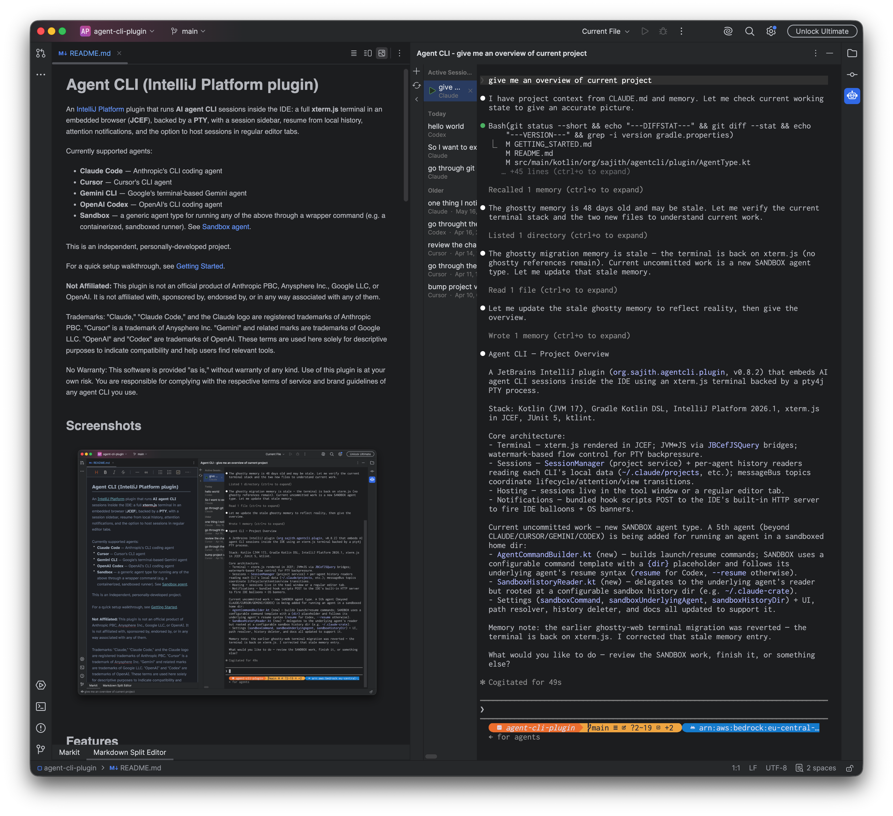

# Six Months with Claude Code: How My Developer Workflow Changed

Since October 2025, I have been using Claude Code extensively for work. In the beginning, there was definitely a learning curve, and I had to adjust my workflow around it. I remember back when I worked as a Kotlin developer at my previous company, I used GitHub Copilot primarily for autocomplete in IntelliJ IDEA. Later on, I used ChatGPT to generate small code blocks and scripts, but most of the time, I was still coding manually by myself.

But with the release of Claude Opus, everything changed. The model was so impressive that, little by little, I started using it for brainstorming, researching, breaking down initiatives into smaller tasks, creating and refining Jira tickets, implementing and testing code, automatically opening PRs, and even handling code reviews. 

However, one thing that really bothered me was the lack of a unified IDE where I could seamlessly use Anthropic models. I tried Cursor, Zed, and Claude Code in the terminal, but as a Python developer, I found myself constantly switching back and forth between PyCharm and other tools. Maybe it's because I'm so used to JetBrains IDEs and compared to PyCharm, other editors felt quite inadequate. 

Having previously developed plugins and even a whole custom distribution of IntelliJ IDEA at a former company, I already knew how to write an IntelliJ plugin. So, I embarked on writing the [agent-cli-plugin](https://sajith.me/agent-cli-plugin/). With Claude Code acting as my "code monkey," it was incredibly fast to come up with an MVP in just a few hours. I've added functionalities and extended it support other CLI agents over time, but now I use it as my primary tool to interact with Claude Code inside PyCharm. My main goal was to get proper rendering, and in my opinion, it looks way better than running Claude Code in PyCharm's default terminal. 

When it comes to my day-to-day processes, I use Claude Code for almost every aspect of my work. Recently, I've settled into the following workflow:

1. **Brainstorm & Research:** I gather all requirements for a given initiative and create a Markdown file with all the information. This file ends up being a mix of LLM generated content and manual adjustments, serving as the core knowledge base for the entire initiative.
2. **Breakdown & Ticket Creation:** I break down the initiative into smaller, implementation and testing ready chunks based on the codebase, saving them as smaller Jira tickets in another Markdown file. I've built a custom Claude skill to format these tickets exactly how I need them. After reviewing and refining them one by one via Claude Code, I use another skill to publish them directly to Jira via the Atlassian MCP.
3. **Team Alignment:** I present the tickets to my team for further refinement and estimation before pulling them into the sprint.
4. **Implementation Planning:** Once I pick up a ticket, a dedicated Claude Code skill fetches it and generates a detailed implementation plan in a Markdown file. Because the Jira tickets are so well specified, the model gets the plan right most of the time, and I rarely have to make any modifications.
5. **Sandboxed Execution:** I execute the plan in a sandboxed Claude Code session. I created a small [claude-crate](https://github.com/sajithdilshan/claude-crate) Docker image containing bare minimal tools and Claude Code, mounting the project directory at container startup. Inside this container, Claude Code runs with the `--dangerously-skip-permissions` flag. I use my `agent-cli-plugin` within PyCharm to launch this sandbox. Because the host machine's codebase is mounted, I can watch file changes happen in real time inside PyCharm. The best part is that while it implements code, writes tests, and finishes the task, I can focus on something else without Claude constantly interrupting me for permissions. Any destructive changes are isolated to the container, and worst case scenario, I can just do a clean git checkout. Note that in this sandbox mode, no MCPs or extra skills are configured. It’s a purely bare bones Claude Code session.
6. **Review & PR:** Once the implementation is done, I use another skill to run a code review on the changes made on the host machine. If tweaks are needed, I use the same session I used for the implementation plan on the host. Finally, I spin up a PR using a skill powered by the GitHub MCP.

Beyond this core workflow, I have various skills for testing, PR code reviews, debugging alerts, and more. With all of this in place, I feel like my productivity has easily doubled. Recently, I even built an experimental personal assistant agent named Jarvis. It has access to my Gmail, Slack, GitHub, Atlassian, and Google Calendar to perform simple tasks based on pre configured permissions. I've also integrated long-term memory and an interactive chat. Because it periodically polls data via these MCPs and updates its memory, I can truly use it as an assistant to retrieve information, dig up context from past emails, or reference old Slack discussions. It's still in the early stages, but the longer I use it, the more personalized and context aware it becomes. 

Thinking back, it's mind blowing that all of this happened in less than a year. I already have a few more ideas for agentic use cases to push my productivity even further, and I honestly wonder where we will all be by the end of this year, or even by next summer.